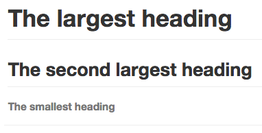

# MARKDOWN
## [Basic writing and formatting syntax](https://docs.github.com/en/get-started/writing-on-github/getting-started-with-writing-and-formatting-on-github/basic-writing-and-formatting-syntax)
## Create sophisticated formatting for your prose and code on GitHub with simple syntax.
## Headings
To create a heading, add one to six `#` symbols before your heading text. The number of `#` you use will determine the size of the heading.

```
# The largest heading
## The second largest heading
###### The smallest heading
```
Rendered H1, H2, and H6 headings



When you use two or more headings, GitHub automatically generates a table of contents which you can access by clicking  within the file header. Each heading title is listed in the table of contents and you can click a title to navigate to the selected section.


Screenshot highlighting the table of contents icon

# Styling text
You can indicate emphasis with bold, italic, or strikethrough text in comment fields and `.md` files.

|Style	|Syntax	|Keyboard shortcut	|Example	|Output|
|:------ |:------|:------ |:------ |:------|
|**Bold**|	`** **` or `__ __	`|`Command`+`B` (Mac) or `Ctrl`+`B` (Windows/Linux)	|`**This is bold text**`|	**This is bold text** |
|*Italic*|`* *` or `_ _`| `Command`+`I` (Mac) or `Ctrl`+`I` (Windows/Linux) | `*This text is italicized*` | *This text is italicized* |
|~~Strikethrough~~|`~~ ~~`|  | `~~This was mistaken text~~` | ~~This was mistaken text~~ |
|**Bold and _nested italic_**| `** **` and `_ _` |  | `**This text is _extremely_ important**` | **This text is _extremely_ important** |
|***All bold and italic***| `*** ***` |  | `***All this text is important***` | ***All this text is important*** |

# Quoting text
You can quote text with a `>`.
```
Text that is not a quote

> Text that is a quote
```


```
Tip: When viewing a conversation, you can automatically quote text in a comment by highlighting the text, then typing `R`. You can quote an entire comment by clicking , then Quote reply. For more information about keyboard shortcuts, see ["Keyboard shortcuts."](https://docs.github.com/en/articles/keyboard-shortcuts)
```
# Quoting code
You can call out code or a command within a sentence with single backticks. 
The text within the backticks will not be formatted. 
You can also press the `Command`+`E` (Mac) or `Ctrl`+`E `(Windows/Linux) keyboard shortcut to insert the backticks for a code block within a line of Markdown.
```
Use `git status` to list all new or modified files that haven't yet been committed.
Rendered inline code block
```


To format code or text into its own distinct block, use triple backticks.

````
Some basic Git commands are:
```
git status
git add
git commit
```

````

Rendered code block


For more information, see ["Creating and highlighting code blocks."](https://docs.github.com/en/articles/creating-and-highlighting-code-blocks)

If you are frequently editing code snippets and tables, you may benefit from enabling a fixed-width font in all comment fields on GitHub. 
For more information, see ["Enabling fixed-width fonts in the editor."](https://docs.github.com/en/github/writing-on-github/getting-started-with-writing-and-formatting-on-github/about-writing-and-formatting-on-github#enabling-fixed-width-fonts-in-the-editor)

# Links
You can create an inline link by wrapping link text in brackets `[ ]`, and then wrapping the URL in parentheses `( )`. 
You can also use the keyboard shortcut `Command`+`K` to create a link. 
When you have text selected, you can paste a URL from your clipboard to automatically create a link from the selection.

```
This site was built using [GitHub Pages](https://pages.github.com/).
```


```
Tip: GitHub automatically creates links when valid URLs are written in a comment. 
For more information, see ["Autolinked references and URLs](https://docs.github.com/en/articles/autolinked-references-and-urls)."
```

# Section links
You can link directly to a section in a rendered file by hovering over the section heading to expose the link:


