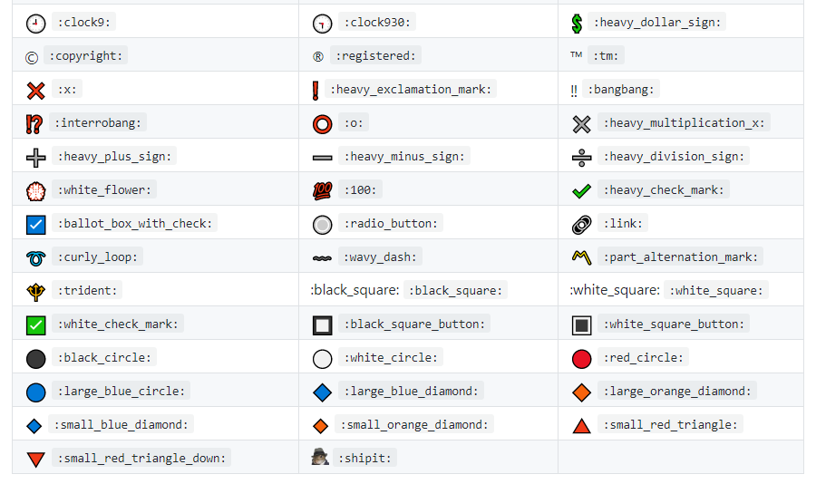

# checkbox 

##

```
- [ ] (for unchecked checkbox)
- [x] (for checked checkbox)
```

- [ ] (for unchecked checkbox)
- [x] (for checked checkbox)

##


```
### Solar System Exploration, 1950s – 1960s

- [ ] Mercury
- [x] Venus
- [x] Earth (Orbit/Moon)
- [x] Mars
- [ ] Jupiter
- [ ] Saturn
- [ ] Uranus
- [ ] Neptune
- [ ] Comet Haley
```

### Solar System Exploration, 1950s – 1960s

- [ ] Mercury
- [x] Venus
- [x] Earth (Orbit/Moon)
- [x] Mars
- [ ] Jupiter
- [ ] Saturn
- [ ] Uranus
- [ ] Neptune
- [ ] Comet Haley

##


```
| Task           | Time required | Assigned to   | Current Status | Finished | 
|----------------|---------------|---------------|----------------|-----------|
| Calendar Cache | > 5 hours  |  | in progress | - [x] ok?
| Object Cache   | > 5 hours  |  | in progress | [x] item1<br/>[ ] item2
| Object Cache   | > 5 hours  |  | in progress | <ul><li>- [x] item1</li><li>- [ ] item2</li></ul>
| Object Cache   | > 5 hours  |  | in progress | <ul><li>[x] item1</li><li>[ ] item2</li></ul>


- [x] works
- [x] works too
```


| Task           | Time required | Assigned to   | Current Status | Finished | 
|----------------|---------------|---------------|----------------|-----------|
| Calendar Cache | > 5 hours  |  | in progress | - [x] ok?
| Object Cache   | > 5 hours  |  | in progress | [x] item1<br/>[ ] item2
| Object Cache   | > 5 hours  |  | in progress | <ul><li>- [x] item1</li><li>- [ ] item2</li></ul>
| Object Cache   | > 5 hours  |  | in progress | <ul><li>[x] item1</li><li>[ ] item2</li></ul>


- [x] works
- [x] works too

##

```
| Projects | Operating Systems | Programming Languages   | CAM/CAD Programs | Microcontrollers and Processors | 
|---------------------------------- |---------------|---------------|----------------|-----------|
| <ul><li>[ ] Blog </li></ul>       | <ul><li>[ ] CentOS</li></ul>        | <ul><li>[ ] Python </li></ul> | <ul><li>[ ] AutoCAD Electrical </li></ul> | <ul><li>[ ] Arduino </li></ul> |
| <ul><li>[ ] PyGame</li></ul>   | <ul><li>[ ] Fedora </li></ul>       | <ul><li>[ ] C</li></ul> | <ul><li>[ ] 3DsMax </li></ul> |<ul><li>[ ] Raspberry Pi </li></ul> |
| <ul><li>[ ] Server Info Display</li></ul>| <ul><li>[ ] Ubuntu</li></ul> | <ul><li>[ ] C++ </li></ul> | <ul><li>[ ] Adobe AfterEffects </li></ul> |<ul><li>[ ]  </li></ul> |
| <ul><li>[ ] Twitter Subs Bot </li></ul> | <ul><li>[ ] ROS </li></ul>    | <ul><li>[ ] C# </li></ul> | <ul><li>[ ] Adobe Illustrator </li></ul> |<ul><li>[ ]  </li></ul> |
```

| Projects | Operating Systems | Programming Languages   | CAM/CAD Programs | Microcontrollers and Processors | 
|---------------------------------- |---------------|---------------|----------------|-----------|
| <ul><li>[ ] Blog </li></ul>       | <ul><li>[ ] CentOS</li></ul>        | <ul><li>[ ] Python </li></ul> | <ul><li>[ ] AutoCAD Electrical </li></ul> | <ul><li>[ ] Arduino </li></ul> |
| <ul><li>[ ] PyGame</li></ul>   | <ul><li>[ ] Fedora </li></ul>       | <ul><li>[ ] C</li></ul> | <ul><li>[ ] 3DsMax </li></ul> |<ul><li>[ ] Raspberry Pi </li></ul> |
| <ul><li>[ ] Server Info Display</li></ul>| <ul><li>[ ] Ubuntu</li></ul> | <ul><li>[ ] C++ </li></ul> | <ul><li>[ ] Adobe AfterEffects </li></ul> |<ul><li>[ ]  </li></ul> |
| <ul><li>[ ] Twitter Subs Bot </li></ul> | <ul><li>[ ] ROS </li></ul>    | <ul><li>[ ] C# </li></ul> | <ul><li>[ ] Adobe Illustrator </li></ul> |<ul><li>[ ]  </li></ul> |

##

```
Function | MySQL / MariaDB | PostgreSQL | SQLite
:------------ | :-------------| :-------------| :-------------
substr | :heavy_check_mark: |  :white_check_mark: | :heavy_check_mark:
```
Function | MySQL / MariaDB | PostgreSQL | SQLite
:------------ | :-------------| :-------------| :-------------
substr | :heavy_check_mark: |  :white_check_mark: | :heavy_check_mark:

##


```
|checked|unchecked|crossed|
|---|---|---|
|&check;|_|&cross;|
```
|checked|unchecked|crossed|
|---|---|---|
|&check;|_|&cross;|

##

I used &#9744; (☐) for [ ] and &#9745; (☑) for [x] and it works for marked.js which says it is compatible with Github markdown. I based my solution on answers for this question. See also this informative answer.

Update: I should have mentioned that when you do it this way, you do not need the <ul>, e.g:
```
| Unchecked | Checked |
| --------- | ------- |
| &#9744;   | &#9745; |
 ``` 
  
| Unchecked | Checked |
| --------- | ------- |
| &#9744;   | &#9745; |
  
##  
  
  You can use emojis
```
Done? | Name
:---:| ---
⬜️| Nope
✅| Yep
  ```
  Done? | Name
:---:| ---
⬜️| Nope
✅| Yep
  
  ##
  
  for uncheck box use 
  :white_large_square 
  and for check box use 
  :white_check_mark 
  
  ##
```  
| demo                                              | demo |
| ------------------------------------------------- | ---- |
| <input type="checkbox" disabled checked /> works  |      |
| <input type="checkbox" disabled /> works here too |      |
```
| demo                                              | demo |
| ------------------------------------------------- | ---- |
| <input type="checkbox" disabled checked /> works  |      |
| <input type="checkbox" disabled /> works here too |      |

  
  ##
  You can check them out. I hope you would find suitable icons for your writing.
  
  
##
```
| Projects | Operating Systems | Programming Languages   | CAM/CAD Programs | Microcontrollers and Processors | 
|---------------------------------- |---------------|---------------|----------------|-----------|
| <ul><li>[ ] Blog </li></ul>       | <ul><li>[ ] CentOS</li></ul>        | <ul><li>[ ] Python </li></ul> | <ul><li>[ ] AutoCAD Electrical </li></ul> | <ul><li>[ ] Arduino </li></ul> |
| <ul><li>[ ] PyGame</li></ul>   | <ul><li>[ ] Fedora </li></ul>       | <ul><li>[ ] C</li></ul> | <ul><li>[ ] 3DsMax </li></ul> |<ul><li>[ ] Raspberry Pi </li></ul> |
| <ul><li>[ ] Server Info Display</li></ul>| <ul><li>[ ] Ubuntu</li></ul> | <ul><li>[ ] C++ </li></ul> | <ul><li>[ ] Adobe AfterEffects </li></ul> |<ul><li>[ ]  </li></ul> |
| <ul><li>[ ] Twitter Subs Bot </li></ul> | <ul><li>[ ] ROS </li></ul>    | <ul><li>[ ] C# </li></ul> | <ul><li>[ ] Adobe Illustrator </li></ul> |<ul><li>[ ]  </li></ul> |
```
| Projects | Operating Systems | Programming Languages   | CAM/CAD Programs | Microcontrollers and Processors | 
|---------------------------------- |---------------|---------------|----------------|-----------|
| <ul><li>[ ] Blog </li></ul>       | <ul><li>[ ] CentOS</li></ul>        | <ul><li>[ ] Python </li></ul> | <ul><li>[ ] AutoCAD Electrical </li></ul> | <ul><li>[ ] Arduino </li></ul> |
| <ul><li>[ ] PyGame</li></ul>   | <ul><li>[ ] Fedora </li></ul>       | <ul><li>[ ] C</li></ul> | <ul><li>[ ] 3DsMax </li></ul> |<ul><li>[ ] Raspberry Pi </li></ul> |
| <ul><li>[ ] Server Info Display</li></ul>| <ul><li>[ ] Ubuntu</li></ul> | <ul><li>[ ] C++ </li></ul> | <ul><li>[ ] Adobe AfterEffects </li></ul> |<ul><li>[ ]  </li></ul> |
| <ul><li>[ ] Twitter Subs Bot </li></ul> | <ul><li>[ ] ROS </li></ul>    | <ul><li>[ ] C# </li></ul> | <ul><li>[ ] Adobe Illustrator </li></ul> |<ul><li>[ ]  </li></ul> |
##
 ```
  | Checkbox Experiments | [ ] unchecked header  | [x] checked header  |
| ---------------------|:---------------------:|:-------------------:|
| checkbox             | [ ] row               | [x] row             |
  ```
  | Checkbox Experiments | [ ] unchecked header  | [x] checked header  |
| ---------------------|:---------------------:|:-------------------:|
| checkbox             | [ ] row               | [x] row             |
  
##

  
##
If you have an issue with the standard markdown code. You can use emojis.

# Native Github
If you are using GitHub's default emojis, you can use these. Something to note is that there is no uncheck, so you have to use different emojis to get that look.

⬜ :white_large_square

✅ :white_check_mark

Source
:white_large_square: https://github.com/ikatyang/emoji-cheat-sheet/blob/master/README.md#geometric
:white_check_mark: https://github.com/ikatyang/emoji-cheat-sheet/blob/master/README.md#other-symbol

Complete list https://github.com/ikatyang/emoji-cheat-sheet/blob/master/README.md
  ##
  
  
  
  
